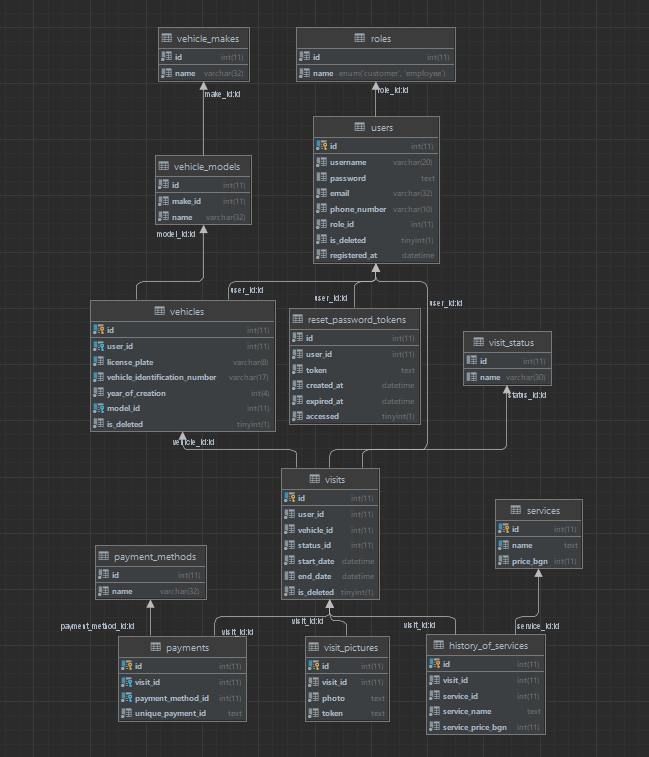

# Alpha Java Track 34 - Team 1 (Nov 21 - April 22)

-  [Trello Board](https://trello.com/b/uAPsMWjC/tasks)

- Tihomir Dimitrov - [GitLab](https://gitlab.com/tddv), [LinkedIn](https://www.linkedin.com/in/dare-to-dream/)

- Denislav Vuchkov - [GitHub](https://github.com/denislav-vuchkov), [LinkedIn](https://www.linkedin.com/in/denislav-vuchkov/)

# Final Project - SmartGarage (April 22)

**Project Description:** 
- SmartGarage is a web application that enables the owners of an auto repair shop
to manage their day-to-day job. New customer walks in the shop and explains what 
the issue is with his vehicle and an employee creates a new personal vehicle in the application.
When the shop visit is created the employee creates a new user, new
 vehicle, and adds the services that will be performed on the car (oil change, brake fluid change…). The new customer receives
 email, that contains information about his automatically generated login information and a separate one with their password.
 Both customers and employees can generate reports for a visit/s in one of 25 currencies which is generated in the backend
 as PDF and sent to their email. 
- At the end of the project we started integration of online card payments.

## Hosted Address:

- http://smartgarage.shop

##Swagger

- If running locally you can access documentation at localhost:8080/swagger-ui/ 
- The hosted website has the documentation at http://smartgarage.shop/swagger-ui/ (you have to be logged in)

## Installation

### Prerequisites
The following list of software should be installed on your computer:
- [Java 11](https://www.oracle.com/java/technologies/javase/jdk11-archive-downloads.html)

### Clone
- Clone or download the project on your local machine using `https://gitlab.com/tddv/smart-garage`
- All the `code` required to get started

### Database Replication
- Run the scripts in the `SQL folder` in the project
- All the `code` required to get started

## Technologies

- **Java 11**
- **Spring MVC**
- **Spring Security**
- **Hibernate**
- **SQL**
- **MariaDB**
- **Mockito**
- **JUnit**
- **Email verification** (utilising SMTP)
- **GitLab CI/CD**
- [**Cloudinary**](https://cloudinary.com/) (uploading and hosting multimedia as 3rd party provider)
- [**FOREX API**](https://www.fastforex.io/) (for getting live data on currency exchange rates)
- [**iText**](https://itextpdf.com/en) (external licensed library for generating PDF documents in Java)
- **Amazon Web Services** (AWS) Relational Database
- **AWS Elastic Beanstalk**
- **HTML**
- **CSS**
- **Thymeleaf**
- **Bootstrap**

## Database Schema

